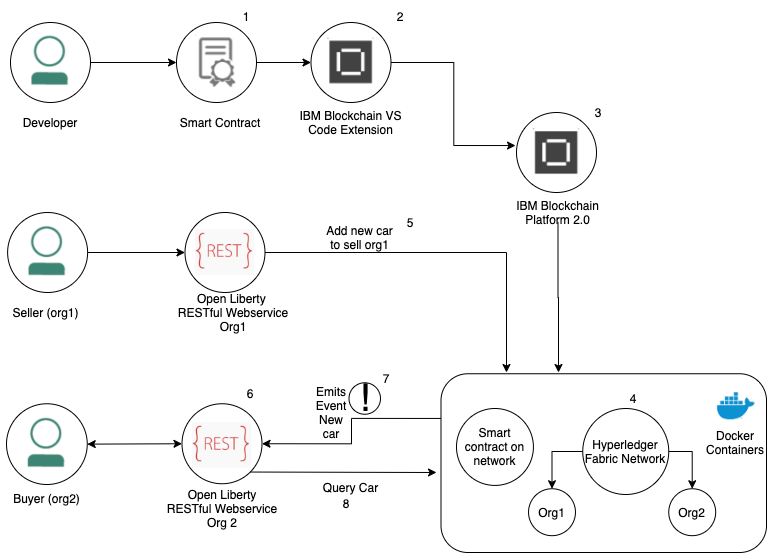

<!-- 
Author: Thomas Jennings
email: thomas.jennings@ibm.com
 -->
# Use Java microservices to listen for events from a distributed blockchain network using Open Liberty.

<!-- # Listen to events out of a distributed blockchain network using Open Liberty -->

> 2 Org Hyperledger Fabric sample using Open Liberty to execute transactions and listen to events with IBM Blockchain Platform

Use a fully distributed 2 Org blockchain network with the use Java microservices and leverage a distributed system to submit transactions and listen to events.

Learn about the fundamentals of blockchain and Open Liberty by following the [Integrate Java microservices with blockchain using Hyperledger Fabric and Open Liberty](https://developer.ibm.com/tutorials/integrate-java-microservices-with-blockchain-using-hyperledger-fabric-and-open-liberty/) to experience starting a 1 Org blockchain network and an Open Liberty server to execute transactions to the blockchain. 


* Use the IBM Blockchain Platform extension to create a fully distributed 2 Org local blockchain network and deploy a sample smart contract Fabcar
* Use the [Open Liberty](https://openliberty.io)   extension to start two Java microservices that can communicate with blockchain
* Transact on the blockchain network from a sellers Java microservice to sell cars. 
* Listen for events emitted out of Hyperledger fabric on the buyers' Java microservice. 

You will use a fully distributed 2 Org blockchain network. Leveraging a distributed network and Open Liberty to submit transactions and listen to events.

Using blockchain provides supply chains a permanent record of transactions which are grouped in blocks that cannot be altered, creating an alternative to traditional paper tracking and manual inspection systems, which can leave supply chains vulnerable to inaccuracies and fraud.

The scenario we are creating is a distributed blockchain network using a buyer and a seller in a supply chain for car sales.

The seller (Org 1) can add a car to the blockchain network; this will emit an event notifying the buyer (Org 2) that a new vehicle has been added to the blockchain network through Open Liberty.

If the buyer is looking for a new car, they can query the vehicle or transaction id recently added to the blockchain network or listen for events automatically.

## Architecture flow

 
 
1. The developer develops a smart contract using Java (Preconfigured FabCar sample)
 
2. Use the IBM Blockchain Platform Extension for VS Code to package the Decentralized FabCar smart contract.

3. Setup and launch the IBM Blockchain Platform 2.0 service

4. The IBM Blockchain Platform 2.0 enables the creation of a network in Docker containers locally enabling installation and instantiation of the FabCar smart contract on the network for 2 organisations

5. Organisation 1, the seller, adds a new car to the distributed ledger available for sale using the Open Liberty Org1 RESTful Webservice and the Fabric SDK.

6. The Open Liberty application for Organisation 2, the Buyer, uses the Fabric SDK to listener to specific transactions and subsequently interact with the deployed network on IBM Blockchain Platform 2.0.

7. The added car on the ledger automatically creates and emits a Transaction (Commit) Event; the listener receives the event for the Buyer.  

8. The buyer is interested in the new car and then queries the car from the distributed ledger.
 


## Prerequisites:

* Java
* Git
* Maven
* Docker
* VS Code

## Steps

* Import the Open Liberty projects into VS Code.

* Import the "fabcar" sample smart contract project into VS Code.

* Start a 2 Org blockchain network and deploy the contract to both organizations.

* Export credentials for Org1 and Org2 to communicate with the blockchain network.

* Startup the buyer and sellers Java microservices.

* Add a car to the Ledger from Org1.

*  Query all Ledger state as a buyer.

* View events from Hyperledger Fabric.

* Listen to Events automatically from Hyperledger Fabric.

* Update the owner of a Car on the Ledger as a buyer.

* Stop the microservices.

* Stop the Blockchain Network.

* Finished.


## 1. Get the development tools

1. If you have not already, download and [Install Visual Studio Code.]((https://code.visualstudio.com/download) )

1.  Install the [IBM Blockchain Platform extension for VS Code.](https://marketplace.visualstudio.com/items?itemName=IBMBlockchain.ibm-blockchain-platform)

    After installation, if any additional prerequisites are needed, the extension will guide you through installing them. Make sure you pick up the Docker prerequisites, as they will be used to create your Fabric network.

1. Install the [Open Liberty Tools for VS Code.](https://marketplace.visualstudio.com/items?itemName=Open-Liberty.liberty-dev-vscode-ext)

## 2. Import the Open Liberty projects into VS Code

1. Add the Org1 project to VS Code, select **File** > **Open** > **eventing/org1**, and then click **Open**.

    This will add the Org1 project to the workspace and will automatically add `Liberty Dev Dashboard` into the VS Code extension. Clicking on the `Liberty Dev Dashboard` will display `org1-ol-blockchain`

1. Open a new VS Code window to add the Org2 project **File** > **New Window**. Import the Org2 project **File** > **Open** > **eventing/org2**, and then click **Open**.

    Adding the Org2 project is what makes the blockchain network distributed as it will add multiple organizations. Open the `Liberty Dev Dashboard` to view the `org2-ol-blockchain`.

## 3. Import the FabCar sample smart contract project into VS Code

1. Click the IBM Blockchain Platform icon in the top right corner (looks like a square).

   

    It may take a moment. In the purple bar at the bottom, it will say, "Activating extension."

1. Select **FabCar** from the "Explore sample code" section.

1. Click the **Clone** button to git clone the sample code for the FabCar sample, and choose a convenient location to clone the fabric sample.

1. Select **Clone**. 

   

1.  From the list of options choose, **FabCar v1.0.0 Java**.

1. Click **Open Locally**.

   

1. In the Command Palette, click **Add to workspace**.

1. *Optional*: Click the **File explorer** button in the top left, and you will see `fabcar-contract-java`, which is the project to create the blockchain network.

1. Click the IBM Blockchain Platform icon on the left side to navigate back to the IBM Blockchain Platform extension for VS Code.

## 4. Start a 2 Org blockchain network and deploy the contract

1. Within **FABRIC ENVIRONMENTS**, select the ` + ` icon to create a customized blockchain network.

1. Select `Create  new from template`, using a template blockchain network structure created by IBM Blockchain platform team.

1. As we are creating a **2 Org network** select **2 Org template (2CAs, 2 peers, 1 channel)**

    

1. Name the Environment `2 Org Local Fabric`

1. Once you're connected to the "2 Org Local Fabric" environment (this happens automatically after it has started), under **Smart Contracts** > **Instantiated**, click **+Instantiate**.`

1. Choose **fabcar-contract-java Open Project** (at the Command Palette prompt).

1. When prompted to `Enter a name for your Java Package`, enter `fabcar`, and press **Enter**.

1. When prompted to `Enter a version for your Java package`, enter `2.0.0`.

1. Select all the Peers to install the smart contract onto and press **OK**
    
    In a supply chain environment the smart contract is a self-enforcing agreement between parties. If all parties agree who are bound into that smart contract data can be added to the blockchain.

    In our example the buyer and the seller are both agreeing to the terms and conditions of the smart contract. 

  

  1. When "Optional functions" appears, enter `initLedger`. This initializes the ledger with unique cars. Not entering the function will result in the blockchain network being empty.

   

1. For all other "Optional functions", press **Enter** to skip.

1. When asked, `Do you want to provide a private data collection configuration file?`, select `No`, as you do not need any private data configuration files.

The notification window at the bottom left will say, `IBM Blockchain Platform extension: Instantiating Smart Contract`. It will take approximately 2 - 5 minutes to instantiate the smart contract.

## 5. Export credentials to communicate with the blockchain network

For Open Liberty to communicate to the blockchain network, Hyperledger Fabric has security features that stop applications attempting to make transactions unless you have the specific profiles and certificate authorities. 

1. Export the Local Fabric Gateways:

   1. In the "FABRIC GATEWAYS" panel, select `2 Org Local Fabric`.

        As there are multiple organizations, we need to connect to both `Org1` and `Org2` as admin to export the connection profiles.  

   1. Select `Org1` and "Choose an identity to connect with" will appear from the command palette. Select **admin**.

      

   1. Hover over the **FABRIC GATEWAYS** heading, click **...** > **Export connection profile**.

      

   1. The `finder` window will open.

   1. Navigate to `Users/Shared/`.

   1. Create a new folder `FabConnection`.

      The full path directory should be `Users/Shared/FabConnection`.

   1. Save the `.json` file as `2-Org-Local-Fabric-Org1_connection.json`.

   1. To disconnect from Org1 Fabric gateway press the "door" icon 

    
 
1. Export the Fabric Wallets:

   1. In the "FABRIC WALLETS" panel, select **1 Org Local Fabric**, then right-click **Org1**, and select **Export Wallet**.

      

   1. Save the folder as `wallet` in the `/Users/Shared/FabConnection/` directory.


## 6. Start Org 1 and Org 2 Microservices

1. You will have two VS Code widows open. As we installed the Dev Tool for Open Liberty, click the Liberty Dev Dashboard icon, and the extension will display the project: org-1-ol-blockchain.

1. Right-click org1-ol-blockchain, and select Start.

    This will quickly start up the microservice within 2 – 5 seconds.

    Org1 is now running on port 9080.

1. Navigate to the other VS Code window, click the Liberty Dev Dashboard icon, and the extension will display the project: org-2-ol-blockchain.

    Right-click org2-ol-blockchain, and select Start.

    Org2 is now running on port 9081.

## 7. Add a car to the ledger

As there are two organizations, we are going to test submitting a transaction from the seller and view the updated Ledger as the buyer.

1. Navigate to the seller's [Java microservice on port 9080](http://localhost:9080/openapi/ui/)

1. Navigate to **POST /System/Resources/Car Add a car to the ledger**.

1. Click **Try it out**.

1. Fill in the example schema with the following values, as illustrated in the figure:

   ```
   {
     "make": "VW",
     "model": "Golf",
     "colour": "White",
     "owner": "Tom Jennings"
     "key": "CAR20"
   }
   ```

## 8. Query all ledger state as a buyer

A buyer, for example, a national car dealer, may be interested in buying a used car and will query the blockchain network.

1. 1. Navigate to the seller's [Java microservice on port 9081](http://localhost:9080/openapi/ui/)

1. Navigate to **GET /System/Resources/Cars Returns all cars > Try it out > Execute.**

This will send a request to the Ledger and return all the cars. A successful response should look like:

```
Queried all Cars Successfully.
Cars:
[{"make":"VW","model":"Golf","colour":"White","owner":"Tom"}}]
```

## 9. Events out of Hyperledger Fabric

Hyperledger Fabric has the event logic preconfigured. When a transaction is submitted the event logic is triggered, however the client is not always listening to events. 

The diagram illustrates how Open Liberty is listening to events from Hyperledger Fabric locally. 

 

1. The seller submits a transaction as a REST request and the Java microservice processes the car and adds it to the blockchain network. <br><br>A. The vehicle can be queried by any organization, as demonstrated in step 7.

2. When the buyer or seller submits a transaction to the Ledger, an event is emitted from Hyperledger Fabric. Organization One does not have the configuration to listen for the said event as the seller is not interested in being notified of the event.

3. For Organisation two, the event triggered by Organization One has the configuration to listen to the events, resulting in the organization receiving the event.

4. Organisation two can manually ask for the recent events that are emitted out of Hyperledger Fabric, through the OpenAPI User Interface. This manually executes the methods to retrieve the events of the cars being added.

There are two ways Organization two can receive the events:

1. Manually ask for the recent events from Hyperledger Fabric, through the OpenAPI User Interface,  executing methods to retrieve the events of the cars being added.

2. There is also an event-driven architecture within Organization two whereby the org can automatically get updates of the events emitted out of Hyperledger Fabric through a servlet.

### Submit a new transaction

1. Navigate to the seller's Java microservice on port 9080: http://localhost:9080/openapi/ui

1. Navigate to **POST /System/Resources/Car Add a car to the ledger**.

    Fill in the example Schema

    ```
    {
     "make": "Range Rover",
     "model": "Sport",
     "colour": "Gunmetal Grey",
     "owner": "David J",
      "key": "CAR20"
    }
    ```


1.  Navigate to `http://localhost:9081/openapi/ui` 

    An event has been triggered out of Hyperledger Fabric


1. Navigate to **GET /System/Resources/TransactionId Returns transactionId data**.

    View the contents of the recently added car. You are manually instantiating the way of listening to the events, as shown in step 4 of the diagram. 

    

    Fill out the example schema with your own cars and see the recent event of your own cars.
 
1. Navigate to **GET /System/Resources/Events Returns events**.

    

    Every transaction submitted to Hyperledger Fabric has a unique transaction id. When pressing execute, it returns the unique transactionid data.

    The transactionid is unique every time an event is emitted.

### Listen to Events automatically from Hyperledger Fabric

Open another tab on the web browser of your choice and experience the event-based driven architecture of listening to events 

1. Navigate to **http://localhost:9081/ol-blockchain/servlet**

    The Servlet is on Org2 listening to events automatically out of Hyperledger Fabric. This is done through a [servlet.](https://openliberty.io/guides/maven-intro.html#creating-the-project-pom-file)  

    

1. Navigate to Org1 and add a car to the ledger **Post /System/Resources/Car Add a car to the ledger.**

1. Click **Try it out.**

1. Fill in the example schema with the following values, as illustrated in the figure:

```
 {
  "make": "Ford",
  "model": "Fiesta",
  "colour": "Blue",
  "owner": "Hannah J",
  "key": "CAR23"
}
```

The event appears successfully on the buyers window, showing the latest transaction that has been added to the ledger.

Try it out by adding more cars to the ledger and viewing the events out of Hyperledger fabric. 

## 10. Update the owner of the car

The buyer on Org2 may decide they want to buy the car from the seller. 

In bitcoin, there is the concept of 'bitcoin miners'. The miners do three main jobs; issuance of new bitcoins, security and confirming transactions. A transaction can only be added to the blockchain once the miners have verified it. The more miners that agree that the transaction is legitimate, the better it is for larger payments.

This is a classic example of all parties agreeing to add a block to the chain, moving the cryptocurrency ownership of someone else.

It is the same in supply chain networks, all parties agree of adding a block to the chain. In Hyperledger Fabric these are called Smart Contracts. 

1. Navigate to Org2 to update the owner of a car **PUT /System/Resources/Car Update the owner of a car in the ledger**

1. Click **Try it out**

1. Fill in the example Schema


```
{
  "make": "string",
  "model": "string",
  "colour": "string",
  "owner": "Yasmin A",
  "key": "CAR23"
}
```

## 11.Query a specific car on the ledger

As the blockchain is distribured you can query the specific car from any organization. However as the buyer has agreed to buy the car query it from Org2

As well as a unique transaction id there is a unique key for every car. The difference between a transaction id and the key is every time a transaction is made, even with the same key, the transaction id changes. They key does not.

1. In the OpenAPI UI, select **GET /System/Resources/Car Returns an individual car by key.**

1. Re-query CAR23 to see the updated owner.


Query the recently added car by inserting the ID and clicking Execute.

The successful response should look like:

   Queried car Successfully.
   Key = CAR23
   Details = {"make":"Ford","model":"Fiesta","colour":"Blue","owner":"Yasmin A"}


## 11. Stop the Open Liberty microservices

Once you have finished, for both organsiations go to VS Code > Liberty Dev Dashboard, and press **Stop**. This will stop the Open Liberty server. 

Now, the servers is off and the application is not running anymore. If you tried to hit one of the endpoints, it would not find it.

## 12. Tear down the blockchain network

*Optional*: You can stop the blockchain network, and save the state on the ledger if you decide to come back to it later. Click on the IBM Blockchain Platform icon on the left side. On Fabric Environments, click **...** > **Stop Fabric Environment**. 

1. You can easily start it again by clicking `1 Org Local Fabric`. 

To remove the Docker images where it is running, on Fabric Environments click **...** > **Teardown Fabric Environment**.

## Conclusion

Well done. You have created a fully distributed 2 Org network, submitted transactions to the blockchain and listened to events from the distributed network. As well as updating the owner of a car based off events. 


